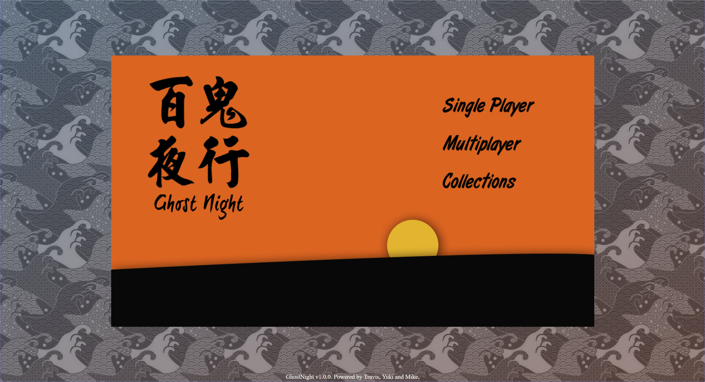
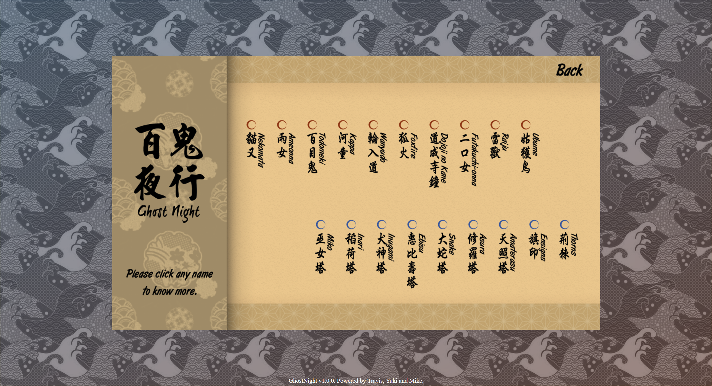

# ghostnight

A 2D RTS multiplayer web game based on NodeJS, Express, CreateJS and Socket.IO.
Including Server Module (GN.Server).

## Features
- Innovational reversed tower defense game
- Enjoyable japanese paper-cut style
- Challenging AI in singleplayer mode
- Online 1vs1 multiplayer (Game rooms)
- Concurrent multiple game instance
- Anti-cheating by server-side game logic

## Screenshots
#### Menu

#### In-game

#### Collection(Wiki)

## How to run
	
	npm install
	npm start

It will handle both static files(web client) serving and game server hosting.